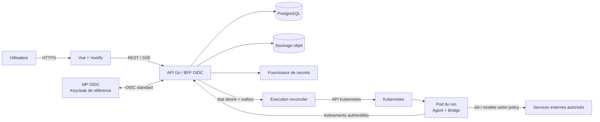

# Architecture cible

## Choix de travail proposés

Ces choix permettent de produire un premier incrément cohérent ; ils restent à confirmer dans le journal de décisions.

- **Frontend** : Vue 3, TypeScript, Vuetify 3, Pinia et Vue Router.
- **API/BFF** : Go, endpoints REST pour le CRUD et SSE pour les événements de run. WebSocket seulement si le protocole du moteur impose un canal bidirectionnel permanent.
- **Données** : PostgreSQL comme source de vérité ; stockage compatible S3 pour artefacts et journaux volumineux.
- **Coordination** : outbox transactionnelle PostgreSQL et worker de réconciliation. Ajouter Redis/NATS uniquement lorsqu'un besoin de débit ou de fan-out est mesuré.
- **Exécution** : contrôleur Go utilisant l'API Kubernetes, sans shell `kubectl`.
- **Identité** : backend OIDC Relying Party/BFF, session opaque en cookie.
- **Secrets** : interface de coffre abstraite ; implémentation initiale à décider entre Vault/KMS et chiffrement applicatif par enveloppe.

## Composants

### Plan de contrôle

1. **Web UI** : navigation, chat, gestion d'organisation, repositories, skills, serveurs MCP, secrets et runs.
2. **API/BFF** : authentification OIDC, autorisation, validation métier, session HTTP, catalogue public des agents autorisés et API utilisateur sans champs sensibles.
3. **Execution reconciler** : lit l'état désiré des runs, crée/suit/nettoie les workloads Kubernetes et répare les divergences.
4. **Event ingestor** : authentifie le bridge du Pod, applique le filtre de secrets avant toute écriture/diffusion, persiste les événements nettoyés et met à jour les projections de chat.
5. **Artifact service** : émet des URL temporaires contrôlées et applique la rétention.
6. **PostgreSQL** : transactions métier, snapshots, messages, états et audit.
7. **Object storage** : artefacts, journaux bruts et éventuellement archives de workspace.
8. **Secret provider** : conserve les valeurs chiffrées et restitue une version uniquement lors du provisioning autorisé.
9. **MCP test worker** : lance un conteneur Docker éphémère par test de connexion, sans exposer la socket Docker au processus API, puis garantit le nettoyage durable.

### Plan d'exécution

Chaque run crée un workload dédié comprenant :

- un conteneur **agent** avec une version d'image épinglée ;
- un **bridge** léger, sidecar ou processus supervisé, qui adapte le protocole natif du moteur au contrat KubeCoder ;
- un volume de workspace propre à la session ;
- des volumes projetés/configurations temporaires en lecture seule ;
- un ServiceAccount sans accès à l'API Kubernetes (`automountServiceAccountToken: false`) ;
- des limites CPU/mémoire/temps et une politique réseau explicite.
- les processus MCP STDIO explicitement liés à l'agent et/ou le client SSE limité aux endpoints autorisés.

Le bridge ne reçoit qu'un jeton de run à durée courte, lié au `run_id`, à l'organisation et aux opérations nécessaires.

## Flux principal

1. L'API valide l'utilisateur, le repository, l'association et la définition d'agent publiée.
2. Une transaction crée le message utilisateur, le snapshot, le run `QUEUED` et un événement outbox.
3. Le reconciler récupère le run, résout les références autorisées et crée les ressources Kubernetes.
4. L'init container prépare le workspace et le repository.
5. Le bridge annonce son démarrage avec un jeton court.
6. L'agent reçoit le message et émet des événements normalisés ; le bridge applique une première redaction avec le dictionnaire propre au run.
7. L'ingestor applique le filtre autoritatif, persiste uniquement la version nettoyée, puis la diffuse ; le navigateur reprend le SSE avec `Last-Event-ID` en cas de coupure.
8. Le reconciler observe l'état terminal, consolide les artefacts et applique la politique de nettoyage.

## Contrats à versionner tôt

- `AgentRuntimeAdapter`: préparer, démarrer, envoyer une entrée, interrompre, exporter/importer un état de session.
- `RunEvent v1`: enveloppe, séquence, type, timestamp, charge utile et niveau de sensibilité.
- `EffectiveConfiguration v1`: image, profil, skills, bindings MCP, outils, ressources et références de secrets.
- `McpTransportAdapter`: handshake, découverte des outils, appel borné, timeout et fermeture pour STDIO ou SSE.
- `SecretProvider`: createVersion, resolveVersion, revoke, delete et audit.
- `RepositoryProvider`: validate, cloneSpec et refreshCredential.

## Déploiement logique

- Namespace du plan de contrôle séparé des namespaces d'exécution.
- Une frontière d'exécution par organisation est la cible de sécurité recommandée ; le coût opérationnel doit être confirmé.
- Migrations de base exécutées par un Job versionné avant le rollout de l'API.
- Ingress TLS vers le frontend/API ; aucun endpoint de Pod exposé publiquement.
- NetworkPolicies par défaut deny, avec sorties DNS, Git et fournisseur de modèle explicitement autorisées.

## Alternatives différées

- CRD/operator Kubernetes : utile à grande échelle, mais le MVP peut réconcilier des Jobs/Pods standards.
- WebSocket partout : inutile si SSE + commandes HTTP couvre le moteur retenu.
- Kafka : non justifié avant mesure de charge et exigence de rétention de flux indépendante.
- Base vectorielle : hors périmètre tant qu'aucun cas de recherche sémantique n'est défini.

